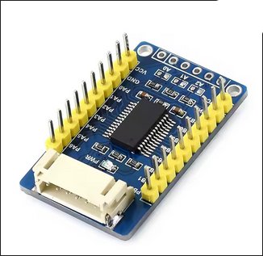

# Simple RaspberryPI GPIO Expander Header File

Is a c++ header file to controll and setup I2C expander boards for raspberry pi's, such as boards like MCP23017 / MCP23008. Automaticly storing the current state. All the setup process is modular managed through a json file without recompiling.



## Dependencies
- [wiringpi](https://github.com/WiringPi/WiringPi.git)
- [nlohmann/json](https://github.com/nlohmann/json.git)
- [make](https://github.com/wkusnierczyk/make.git)

## Setup
### RaspberryPI
- enable I2C [tutorial](https://fibstack.com/articles/three_ways_to_enable_i2c_on_rpi/)
- connect the expansion boards
- install the i2c tools and list all devices
```bash
sudo apt install i2c-tools
i2cdetect -y 1
```
### Config file
The Json file in the home folder is used to setup the amount of boards, the types of every pin (input or output), and the default value.

### Code
In the main.cpp you need to include the gpio/gpio.h file and create / init the Gpio::Info struct

```c++
#include "gpio/gpio.h"

int main() {
    Gpio::Info gpioInfo;

    Gpio::init(gpioInfo);

    return 0;
}
```

## Usage
### Types
The Info struct stores a count var and a vector of Boards wich is a struct including the I2C address and 2 arrays of Pins for the 2 port of each board. A Pin is a Type with 2 booleans (type and value).

### Functions
With the two functions setPin and readPin you are able to communicate with the boards

#### setPin()
```c++
Gpio::setPin(Gpio::PinPosition(0, Gpio::BOARD_A, 0), info);
```
##### Parameters:
    - PinPosition position (is a struct to locate a pin by the board idx, a bool to indicate the port and a idx to locate the port local pin)
    - Info &info (to automaticly sync the update)
    - bool value (HIGH / LOW)
##### Return type
    - bool (to indicate if it failed (false = failed))


#### readPin()
```c++
std::array<bool, 2> pin = Gpio::readPin(Gpio::PinPosition(0, Gpio::BOARD_A, 0), info);
```
##### Parameters:
    - PinPosition position (is a struct to locate a pin by the board idx, a bool to indicate the port and a idx to locate the port local pin)
    - Info &info (to automaticly sync the update)


##### Return type
    - std::array<bool, 2>
        - idx 0: indicator if failed (failed = false)
        - idx 1: returns the read value
## Build
### Script
there is a build and run script, wich requires make:
```bash
chmod +x build_run.sh
./build_run.sh
```
### make through the makefile
if you want to use make, make shure it's installed, and run it:

```bash
mkdir -p bin
make clean
make
./bin/app
```

### Compiler
- g++:
```bash
mkdir -p bin
g++ -Wall -O2 src/main.cpp src/json/json.cpp src/gpio/gpio.cpp -o bin/app -lwiringPi
```
- clang:
```bash
mkdir -p bin
clang++ -Wall -O2 src/main.cpp src/json/json.cpp src/gpio/gpio.cpp -o bin/app -lwiringPi
```
